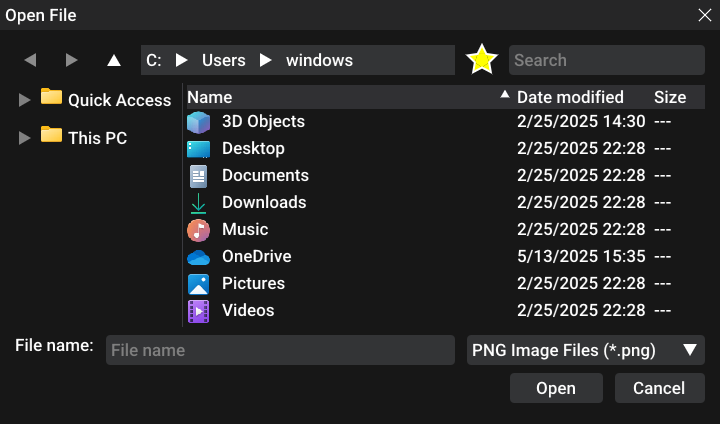
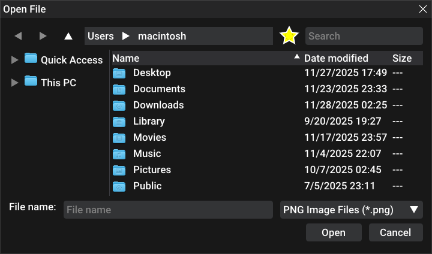
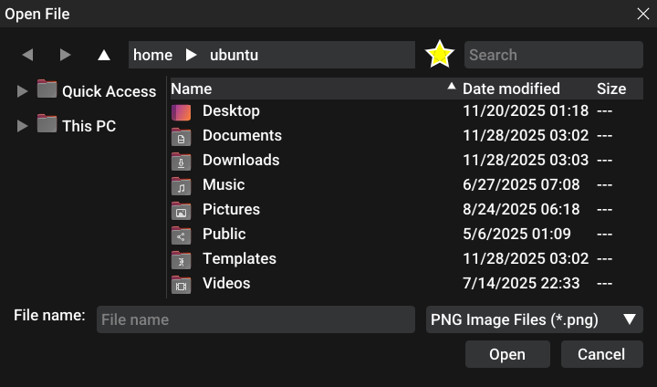

# ImFileDialog
A simple file dialog library for Dear ImGui.

This library supports favorites, default native icon theme, image previews, zooming in, etc.

## Usage

Here's an example on how to use ImFileDialog:

1. You need to set the CreateTexture and DeleteTexture function
```c++
ifd::FileDialog::Instance().CreateTexture = [](uint8_t *data, int w, int h, char fmt) -> void * {
  GLuint tex = 0;
  glGenTextures(1, &tex);
  glBindTexture(GL_TEXTURE_2D, tex);
  glTexParameteri(GL_TEXTURE_2D, GL_TEXTURE_MIN_FILTER, GL_NEAREST);
  glTexParameteri(GL_TEXTURE_2D, GL_TEXTURE_MAG_FILTER, GL_NEAREST);
  glTexParameteri(GL_TEXTURE_2D, GL_TEXTURE_WRAP_S, GL_CLAMP_TO_EDGE);
  glTexParameteri(GL_TEXTURE_2D, GL_TEXTURE_WRAP_T, GL_CLAMP_TO_EDGE);
  glTexImage2D(GL_TEXTURE_2D, 0, GL_RGBA, w, h, 0, (fmt == 0) ? GL_BGRA : GL_RGBA, GL_UNSIGNED_BYTE, data);
  glGenerateMipmap(GL_TEXTURE_2D);
  glBindTexture(GL_TEXTURE_2D, 0);
  return (void *)(uintptr_t)tex;
};
ifd::FileDialog::Instance().DeleteTexture = [](void *tex) {
  GLuint texID = (GLuint)(uintptr_t)tex;
  glDeleteTextures(1, &texID);
};
```

2. Open a file dialog on button press (just an example):
```c++
if (ImGui::Button("Open a texture"))
  ifd::FileDialog::Instance().Open("TextureOpenDialog", "Open a texture", "Image file (*.png;*.jpg;*.jpeg;*.bmp;*.tga){.png,.jpg,.jpeg,.bmp,.tga},.*");
```

3. Render and check if done:
```c++
if (ifd::FileDialog::Instance().IsDone("TextureOpenDialog")) {
  if (ifd::FileDialog::Instance().HasResult()) {
    std::string res = ifd::FileDialog::Instance().GetResult().u8string();
    printf("OPEN[%s]\n", res.c_str());
  }
  ifd::FileDialog::Instance().Close();
}
```

File filter syntax:
```
Name1 {.ext1,.ext2}, Name2 {.ext3,.ext4},.*
```

## Running the example
If you want to test ImFileDialog, run these commands:
```bash
cmake .
make
./ImFileDialogExample
```

## Screenshots
Windows:

Macintosh:

Ubuntu:


## LICENSE
ImFileDialog is licensed under MIT license. See [LICENSE](./LICENSE) for more details. 
